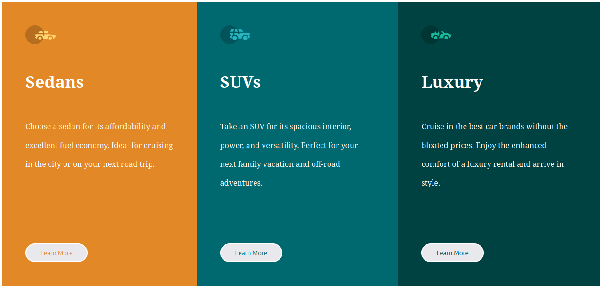

# 3 Column Preview Card Component

Solución al reto [3-column-preview-card-component](https://www.frontendmentor.io/challenges/3column-preview-card-component-pH92eAR2-) de Frontend Mentor.

## 🔗 Links

- 🌐 Demo en vivo: [GitHub Pages](https://o0vanfanel0o.github.io/3-colum-preview/)
- 💻 Repositorio: [GitHub](https://github.com/o0VanFanel0o/3-colum-preview)

## 📸 Vista previa

## 🛠️ Tecnologías

- HTML5 semántico
- CSS3 — Flexbox, variables CSS, diseño responsivo

## 🎯 Lo que aprendí

- Estructurar layouts de múltiples columnas con Flexbox
- Usar variables CSS para mantener colores consistentes
- Crear diseños responsivos que se adapten a móvil y escritorio

## 👤 Autor

- GitHub: [@o0VanFanel0o](https://github.com/o0VanFanel0o)
